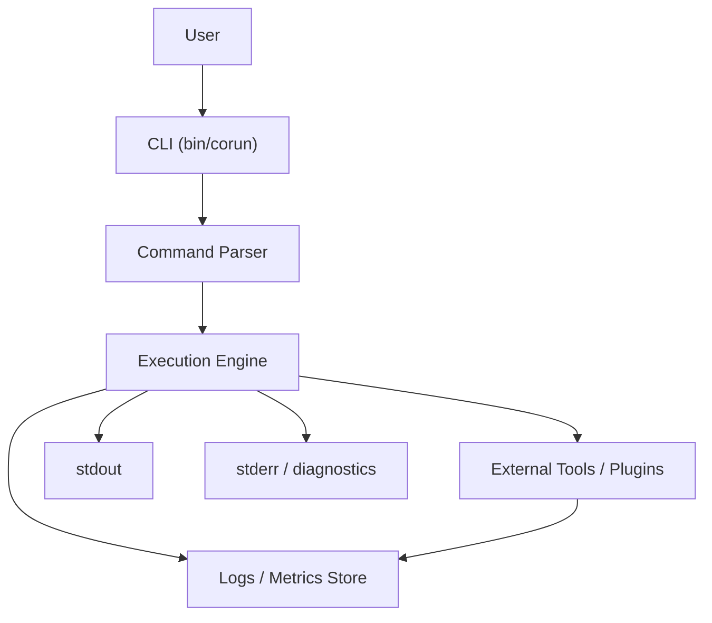

# データフロー

高レベルフロー:

1. ユーザーが CLI を起動しコマンドを入力（例: `corun run`）。
2. CLI が引数・フラグをパースし、実行コンテキストを構築する。
3. タスク定義（ファイルまたは引数）を読み込み、検証を行う。
4. 実行エンジンがタスクを順次処理し、サブプロセスやツールを呼び出す。
5. 各ステップでログを生成し、`stdout`/`stderr` とローカルログディレクトリへ出力する。
6. 実行結果（終了コード・成果物）を返す。

入出力の境界:

- stdin: パイプ入力やユーザープロンプト
- stdout: 実行結果の主要出力（マシン可読であることが望ましい）
- stderr: エラー・進捗・デバッグ情報

データ整合性と再現性:

- タスク定義はバージョン管理を想定し、変更時は `updated` / `version` を管理する。
- 実行ログにはコマンドラインと `spec_id`、`version` を含めることで再現性を担保する。

---

## データフロー図（概念）

