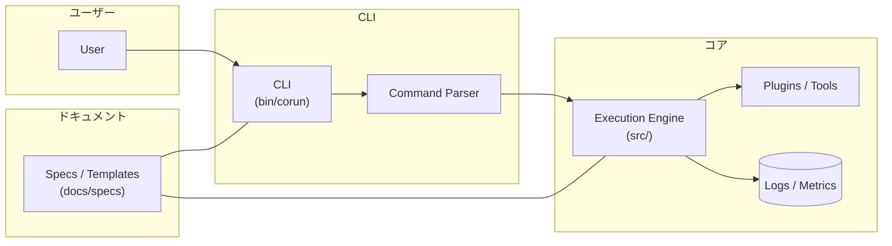

# システム概要

目的:

`corun` はコマンドライン中心のタスク実行・自動化ツールです。主要な目的はタスクの定義・実行・再現性を提供し、開発者や自動化エージェントが容易にワークフローを組めるようにすることです。

主要コンポーネント:

- `CLI`（`bin/corun`）: ユーザー操作の入り口。コマンドパース、フラグ処理、入力検証を行う。
- `コアライブラリ`（`src/`）: タスク実行ロジック、プラグイン/ツール連携、ログ出力を提供。
-- `設定/テンプレート`（`docs/specs/features/template.md` 等）: 仕様に基づくテンプレート。
- `ドキュメント`（`docs/`）: 仕様、導入、アーキテクチャを格納。

ディレクトリ（抜粋）:

- `bin/` — 実行スクリプト
- `src/` — 実装ソース
- `docs/` — ドキュメント

設計原則:

- シンプルさ: CLI は予測可能で理解しやすいインターフェイスを提供する。
- 再現性: タスクは同じ定義で再現可能な振る舞いを目指す。
- 拡張性: サブコマンドやプラグインで拡張しやすい構造とする。

## アーキテクチャ図（概念）

